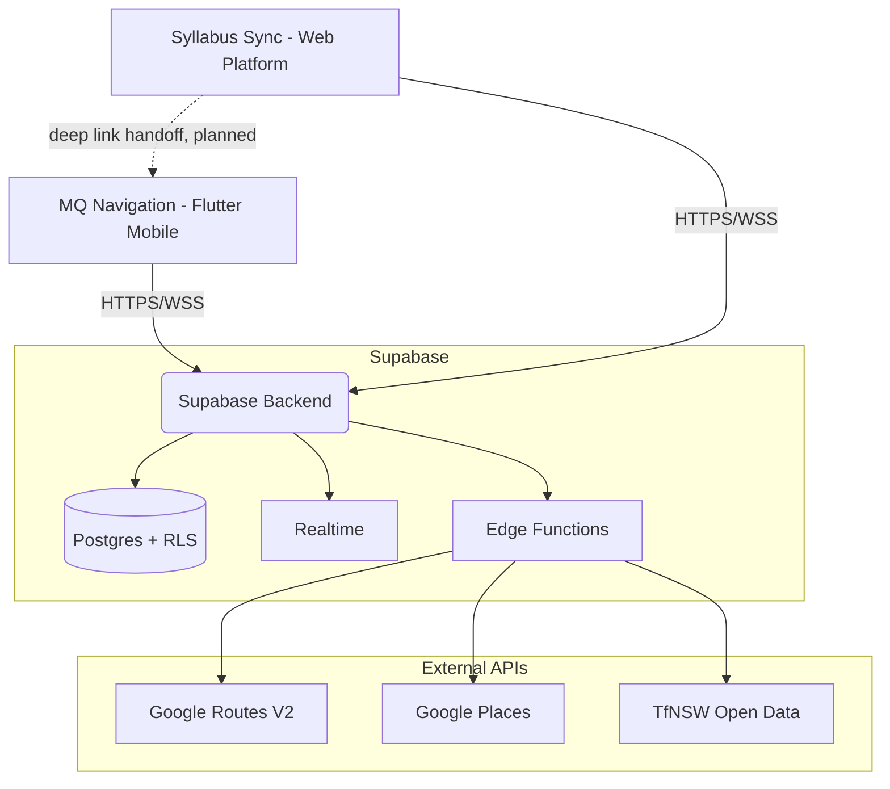

<div align="center">

<!-- Typing animation -->
[](https://readme-typing-svg.demolab.com)

<!-- Badges -->


</div>


<br/>

# MQ Navigation — Mobile Campus Wayfinding for Syllabus Sync

> **The mobile campus wayfinding companion for the Syllabus Sync ecosystem.**

MQ Navigation is a Flutter-based campus wayfinding companion for the [Syllabus Sync](https://github.com/mrpouyaalavi/syllabus-sync) ecosystem. It helps students and visitors discover Macquarie University buildings, services, transport, safety resources, and campus points of interest through a mobile-first navigation experience — with dual-renderer maps, Supabase-backed routing, a compass mode, a safety toolkit, live metro countdowns, and multi-language support.

MQ Navigation is an independent, unofficial project and is **not affiliated with or endorsed by Macquarie University**. It began life as a standalone campus navigation prototype using Macquarie University as its initial dataset and use case, and it is now evolving into the mobile/campus wayfinding layer for the broader Syllabus Sync student platform — supporting everyday campus discovery, student onboarding, and Open Day-style visitor use cases along the way.

**[📖 Project Origin & Academic Context](#-project-origin--academic-context)** &nbsp;·&nbsp; **[📸 Screenshots](#screenshots)** &nbsp;·&nbsp; **[🏗️ Architecture](docs/ARCHITECTURE.md)** &nbsp;·&nbsp; **[🔐 Security Posture](docs/SECURITY_POSTURE.md)**

<br/>


<br/>

## 🎯 Problem & Value Proposition

Generic campus maps (Google/Apple Maps) stop at the street kerb and don't know which door is *18 Wally's Walk*. Existing university portals often require sign-on and offer a poor mobile experience. MQ Navigation addresses this by providing:

- **Mobile-first campus wayfinding** — Building and key location discovery optimised for phone-sized screens.
- **Building and location discovery** — 161+ named campus buildings, services, and points of interest pinpointed at the correct entrance.
- **Syllabus Sync deep-link handoff** — Syllabus Sync can hand a destination (a class, event, or building) straight to MQ Navigation for the wayfinding step. See [Deep linking from Syllabus Sync](#-deep-linking-from-syllabus-sync).
- **Favourites and saved places** — Heart-toggle, edit-note, and swipe-to-delete for personalised place saving (cloud-synced when signed in).
- **Safety and support information** — One-tap access to emergency contacts, AEDs, first aid, campus shuttle, and torch.
- **Routing and transit** — Server-side walking/driving/cycling/transit routing via a Supabase Edge proxy; live metro countdown on the home screen.
- **Privacy-aware design** — Optional account, no analytics SDKs, GPS used ephemerally and never persisted.

<br/>


<br/>

## 🔗 Syllabus Sync ecosystem role

[Syllabus Sync](https://github.com/mrpouyaalavi/syllabus-sync) is the broader student experience platform — timetables, unit/class schedules, deadlines, and academic planning. MQ Navigation is its **campus and mobile wayfinding layer**: the piece that answers "where actually is that room, and how do I get there?"

- **Independent app.** MQ Navigation can be launched and used entirely on its own — no Syllabus Sync account or session is required.
- **Deep-link handoff.** Syllabus Sync can hand off a destination (a class location, Open Day item, or building) to MQ Navigation via a deep link. See the dedicated section below for the current implementation status.
- **Shared backend.** Both apps can point at the same Supabase project, sharing schema, Auth users, and Edge Functions (e.g. `maps-routes`, `tfnsw-proxy`) rather than each running its own backend.
- **Future direction:** Syllabus Sync handles academic planning, MQ Navigation handles campus routing, and a planned "Sylla" AI assistant layer sits across both to help students plan and navigate their day.

MQ Navigation is a separate project from **MQ Journey**, an Open Day-focused visitor experience. This repository is not MQ Journey — Open Day browsing here is one supported use case among several, not the product's primary identity.

<br/>


<br/>

## 📲 Deep linking from Syllabus Sync

The intended integration point between the two products is a deep link handoff:

1. A user is inside Syllabus Sync, viewing a class, campus location, Open Day destination, or building.
2. They tap a **"Navigate" / "Open in MQ Navigation"** button.
3. Syllabus Sync opens MQ Navigation via a deep link.
4. If MQ Navigation is installed, it opens directly to the relevant destination or map context.
5. If it isn't installed, the user should be prompted to install the app (or land on a fallback/download page) — this half of the flow lives on the Syllabus Sync side.

**What's implemented today in this repo:**

- A stable, versioned deep-link contract lives in [`lib/features/deep_link/deep_link_contract.dart`](lib/features/deep_link/deep_link_contract.dart) and is wired to the `/open` GoRouter route (see [`docs/route_matrix.md`](docs/route_matrix.md)). It recognises three query shapes, first match wins:
  - `/open?destination=<buildingId>` — focus the map on a known building, e.g. `?destination=E7A`
  - `/open?q=<search>` — filter the map by a free-text query, e.g. `?q=library`
  - `/open?lat=<double>&lng=<double>` — drop a "meet here" pin at coordinates
- A custom URL scheme, `io.mqnavigation://`, is registered on Android and iOS. Today it is wired for two concrete flows: Supabase auth callbacks (`io.mqnavigation://callback`) and a "meet here" pin (`io.mqnavigation://meet?lat=...&lng=...`), handled in [`lib/app/mq_navigation_app.dart`](lib/app/mq_navigation_app.dart). An Android App Link is also verified for `https://mqnavigation.io/auth`.
- The `/open` route itself is reachable via in-app and web navigation and is unit-tested at the parsing level, but it is **not yet registered as an OS-level intent filter / universal link** (no `io.mqnavigation://open` or `https://mqnavigation.io/open` entry exists in the Android manifest or iOS entitlements yet).

**In short:** the Syllabus Sync → MQ Navigation handoff contract and internal routing exist and are stable for integrators to build against, but the last mile — registering `/open` as an externally-tappable link and building the "not installed" fallback page — is a **planned integration**, not a fully wired end-to-end flow yet. Treat the example URLs above as the target contract, not a guarantee that tapping them from another app opens MQ Navigation today.

**Architecture at a glance:**

```
Syllabus Sync                          MQ Navigation
──────────────                         ─────────────
academic planning                      receives deep link
timetable / deadlines          ──▶     resolves building / destination
campus location references             opens map or route context
"Navigate" button                      handles campus wayfinding

Fallback (planned): app installed → open destination directly
                     app not installed → prompt to install MQ Navigation
```

<br/>


<br/>

## Screenshots

> Screenshots below reflect the current app screens. If you update a flow, please refresh the matching screenshot.

<div align="center">

| Login | Home |
|:---:|:---:|
|  |  |

| Campus Map | Safety |
|:---:|:---:|
|  |  |

| Favourites | Notifications | Settings |
|:---:|:---:|:---:|
|  |  |  |

</div>

<!-- TODO: capture screenshots for building detail, search/location discovery, transit/metro countdown, and the Syllabus Sync deep-link handoff flow once demonstrable. -->

<br/>


<br/>

## Key Features

```text
╔══════════════════════════════════════════════════════════════════════╗
║  📍  Campus location discovery: 161+ named buildings & services      ║
║  🗺  Mobile-first map experience: Google Maps + illustrated campus   ║
║  🔍  Building and service search with entrance-accurate results      ║
║  🔗  Syllabus Sync deep-link handoff (destination / search / pin)    ║
║  ❤️  Favourites / saved places: heart-toggle, note, swipe-to-delete  ║
║  🚆  Metro countdown via TfNSW Open Data proxy                       ║
║  🚨  Safety resources: 000, AEDs, first aid, shuttle, torch          ║
║  🔐  Privacy-aware: optional account · zero analytics packages       ║
║  🌍  35 locales · RTL layout support for ar/fa/he/ur                 ║
║  ☁️  Supabase backend: Auth, Postgres, Realtime, Edge Functions      ║
╚══════════════════════════════════════════════════════════════════════╝
```

Open Day event browsing is one supported use case built on top of this feature set (`lib/features/open_day/`) — it is not the whole product.

<br/>


<br/>

## 🏗️ Technical Architecture Overview

MQ Navigation is built on a modern Flutter stack designed for mobile usability, type safety, privacy-aware data handling, and maintainable feature modules.

### System Architecture



### Runtime Stack

| Layer | Technology |
|-------|-----------|
| **Framework** | Flutter 3.11+ (verified on 3.44) |
| **State** | Riverpod 3.2 (Notifier / AsyncNotifier) |
| **Routing** | GoRouter 17.1 (StatefulShellRoute, 4 tabs + standalone routes + `/open` deep-link route) |
| **Maps** | google_maps_flutter 2.15 / flutter_map 8.2 (dual renderer) |
| **Backend** | Supabase (Postgres, RLS, Realtime, Deno Edge Functions) |
| **Location** | geolocator 14 (raw GPS + last-known fallback, emulator mock rejection) |
| **Compass** | flutter_compass 0.8 |
| **Notifications** | Firebase Messaging + flutter_local_notifications 21 |
| **i18n** | flutter_localizations + intl — 35 ARB locales, RTL for ar/fa/he/ur |
| **Security** | flutter_secure_storage 10 (iOS Keychain / Android Keystore) |
| **Deep linking** | app_links 7 (custom scheme `io.mqnavigation://`, Android App Link for `/auth`) |

### Key Architectural Decisions

- **Defensive bootstrap with timeouts:** `Firebase.initializeApp()` and `Supabase.initialize()` are both wrapped in `.timeout()` calls so the app cannot hang on a stalled network during cold start.
- **Silent existing-user detection:** `AuthRepository.signUp` inspects `response.user.identities` to detect when Supabase silently returns an existing-confirmed account and shows a real error instead of a misleading "Account created" banner.
- **Renderer-aware Building actions:** `BuildingActionsSheet` distinguishes "View in Campus Map" (marker only) from "Navigate with Google Maps" (route preview auto-loaded) via a `?preview=route` query parameter.
- **Deep-link contract as the integration boundary:** `lib/features/deep_link/deep_link_contract.dart` is the single source of truth for how sibling apps (Syllabus Sync) should construct links — internal GoRouter paths can change freely, this contract should not.
- **CI privacy guard:** `scripts/check.sh` refuses to compile if any analytics package (`firebase_analytics`, `google_analytics`, `appsflyer`, `amplitude`, `mixpanel`, `segment`, `sentry_flutter`, `facebook_app_events`) is added to `pubspec.yaml`.

> **Deep Dive:** [`docs/ARCHITECTURE.md`](docs/ARCHITECTURE.md) · [`docs/SECURITY_POSTURE.md`](docs/SECURITY_POSTURE.md) · [`docs/route_matrix.md`](docs/route_matrix.md)

<br/>


<br/>

## 🔒 Privacy-Aware Design

Privacy is treated as an architectural concern, not a feature flag.

| Principle | Implementation |
|-----------|---------------|
| Optional account | Auth is **fully optional** — the app opens straight to `/home` without login. An account is only needed for cloud-synced favourites. |
| No analytics packages | No analytics, telemetry, or crash reporting packages included. A CI guard blocks them at build time. |
| Ephemeral location use | GPS is used for active navigation only — not persisted, not transmitted to any external service. |
| Local-only preferences | Theme, locale, commute mode, and quiet hours are stored via `SharedPreferences` + `FlutterSecureStorage`. |
| Safety privacy | Emergency contacts use tap-to-dial — location is **never automatically shared**. |
| On-device compass | All heading calculation happens on-device. No data leaves the phone. |

> **Defence-in-depth model:** [`docs/SECURITY_POSTURE.md`](docs/SECURITY_POSTURE.md) · [`docs/key_inventory.md`](docs/key_inventory.md)

<br/>


<br/>

## Who is this for?

| Persona | Goals | Relevant capability |
|---------|-------|---------------------|
| **A Syllabus Sync user** planning a class or event. | Tap "Navigate" on a class/location in Syllabus Sync and get turn-by-turn help finding the building. | Deep-link handoff into MQ Navigation's map and routing. |
| **"Open Day Olivia"** — Year 12 prospective student visiting campus for the first time. | Find the Faculty of Arts building, the Library, and where her parents parked. | Illustrated campus map with 161+ named buildings — Google Maps shows roads, not which door is *18 Wally's Walk*. |
| **"Commuter Chen"** — first-year student catching the Metro. | Know if he's late for his 9am tutorial, or find the nearest defibrillator. | Live metro countdown on the home screen + Safety Toolkit one tap away. |
| **"International Isha"** — new student navigating campus in a second language. | Read the app in her preferred language. Save rooms mentioned by her supervisor. | 35-language i18n with RTL layout support for Arabic, Farsi, Hebrew, and Urdu. |

**Why a dedicated campus app over Google/Apple Maps?** Generic maps stop at the street. MQ Navigation starts at the building entrance — with a privacy-aware approach and campus-specific data baked in.

<br/>


<br/>

## Device Compatibility

| Platform | Status | Notes |
|----------|--------|-------|
| **Android emulator** (API 33+) | ✅ Verified | All features verified. |
| **Android physical device** | ✅ Verified | Compass, flashlight, GPS, push notifications all functional. |
| **Chrome (web)** | ✅ Core features | Auth, favourites CRUD, maps, routing, transit countdown work. Compass mode and flashlight gracefully degrade — UI shows an "unsupported on this device" fallback. |
| **iOS device** | ⚠️ Expected / not fully verified | Native build configured for iPhone (iOS 17+). Custom URL scheme `io.mqnavigation://` registered for auth callbacks. Full device testing not guaranteed. |
| **macOS desktop** | ⚠️ Expected / not fully verified | Location, auth, and dual-renderer configured. `CFBundleURLTypes` registered so auth deep links return to the app. Google Maps falls back to OSM (plugin limitation). Full device testing not guaranteed. |

If a platform-specific issue surfaces, the relevant feature renders a typed `MapStateError` fallback rather than crashing.

<br/>


<br/>

## Repository Layout

```text
lib/
├── app/              Bootstrap, router (incl. /open deep-link route), theme, l10n (35 ARB locales)
├── core/             Config, error handling, logging, networking, security
├── shared/           Extensions, models, widgets (MqButton, MqCard, MqInput)
└── features/
    ├── auth/         Supabase Auth (login, signup, session persistence, gate) — optional
    ├── favorites/    Building favourites CRUD (controller, repo, datasource, UI)
    ├── home/         Welcome dashboard, onboarding, metro countdown
    ├── map/          Dual-renderer, routing, compass mode, search, favourites
    ├── safety/       Safety toolkit, emergency contacts, first aid / AED, torch
    ├── notifications/ FCM push, local reminders, inbox
    ├── open_day/     Open Day event browsing & reminders (a supported use case)
    ├── settings/     Preferences, privacy badge, data wipe, account management
    ├── transit/      Metro/bus/train search, commute prefs
    ├── timetable/    Unit and class schedule entities/repository (early-stage)
    └── deep_link/    Syllabus Sync deep-link contract (see above)

test/                 323 widget & unit tests (flutter_test suite)
supabase/             Edge Functions: maps-routes, maps-places, tfnsw-proxy, notify, cleanup-cron
docs/                 Reference documents (architecture, security, inventories)
screenshots/          Screen captures used in this README
scripts/              run.sh, check.sh (quality gate), sync_supabase_secrets.sh
```

> **Full Inventory:** [`docs/map_inventory.md`](docs/map_inventory.md) · [`docs/endpoint_inventory.md`](docs/endpoint_inventory.md) · [`docs/entity_inventory.md`](docs/entity_inventory.md)

<br/>


<br/>

## Quick Start

### Prerequisites
- Flutter `3.11+` ([install guide](https://docs.flutter.dev/get-started/install))
- Android SDK / Xcode (for device builds)
- A Supabase project is **required** for routing, transit, favourites sync, and auth (Edge Functions: [`maps-routes`](supabase/functions/maps-routes/), [`tfnsw-proxy`](supabase/functions/tfnsw-proxy/)). There is no fully offline/demo mode — the map UI and static building data work without a network, but routing, transit countdown, and cloud-synced favourites need a reachable Supabase project.
- A Google Maps API key is required for the Google Maps renderer; without it, the app still runs using the illustrated campus map renderer. A TfNSW Open Data key is required only for live metro countdowns.

### Setup
```bash
# Clone and install
git clone https://github.com/mrpouyaalavi/MQ_Navigation.git
cd MQ_Navigation
flutter pub get

# Configure environment
cp .env.example .env
# Edit .env with your Supabase + Google Maps + TfNSW credentials
# (see docs/env_inventory.md for the full variable list)

# Generate localisations
flutter gen-l10n

# Run the app
flutter run --dart-define-from-file=.env
# Or via convenience script:
./scripts/run.sh
```

> In debug mode, a bare `flutter run` also works without a `.env` file — `env_config.dart` ships hardcoded development defaults for local iteration.

### Quality Assurance
```bash
./scripts/check.sh             # 9 steps (includes debug APK build)
./scripts/check.sh --quick     # 8 steps (skips build)
./scripts/check.sh --fix       # auto-format instead of read-only check
./scripts/check.sh --verbose   # stream command logs to terminal
```

| Step | What it enforces |
|------|-----------------|
| `flutter pub get` | Valid dependency resolution |
| `dart format` | Code formatting (`lib/`, `test/`, `scripts/`, `integration_test/`) |
| `flutter analyze` | Static analysis with hardened lint rules — verified **0 issues** as of this README's last audit |
| `flutter test` | Verified **323 tests passing** as of this README's last audit |
| `flutter gen-l10n` | Localisation generation (35 locales) |
| Untranslated check | `.dart_tool/untranslated.json` — new keys tracked as non-blocking |
| **Privacy guard** | **Blocks** `firebase_analytics`, `google_analytics`, `appsflyer`, `amplitude`, `mixpanel`, `segment`, `sentry_flutter`, `facebook_app_events` |
| **Secret scan** | Flags hardcoded API keys (`sk-*`, `AIza*`) in `lib/` `test/` `scripts/` |
| `flutter build apk --debug` | Android APK compiles (skipped with `--quick`) |

<br/>


<br/>

## Documentation Map

| Document | Path |
|----------|------|
| Architecture | [`docs/ARCHITECTURE.md`](docs/ARCHITECTURE.md) |
| Security Posture | [`docs/SECURITY_POSTURE.md`](docs/SECURITY_POSTURE.md) |
| Endpoint Inventory | [`docs/endpoint_inventory.md`](docs/endpoint_inventory.md) |
| Entity Inventory | [`docs/entity_inventory.md`](docs/entity_inventory.md) |
| Environment Variables | [`docs/env_inventory.md`](docs/env_inventory.md) |
| API Keys & Service Accounts | [`docs/key_inventory.md`](docs/key_inventory.md) |
| Map Inventory | [`docs/map_inventory.md`](docs/map_inventory.md) |
| Notification Matrix | [`docs/notification_matrix.md`](docs/notification_matrix.md) |
| Route Matrix (incl. deep-link routes) | [`docs/route_matrix.md`](docs/route_matrix.md) |
| Project Report (essay) | [`PROJECT_REPORT.md`](PROJECT_REPORT.md) |
| Contributing | [`CONTRIBUTING.md`](CONTRIBUTING.md) |
| Agent Rules & Changelog | [`AGENT.md`](AGENT.md) |

<br/>


<br/>

## 🎓 Project origin & academic context

MQ Navigation began as a standalone Flutter campus wayfinding prototype, originally developed as the **COMP3130 Mobile App Development** major project at Macquarie University (Pouya Alavi Naeini and Raouf Abedini). It has since been extended beyond that assignment scope into the mobile campus wayfinding layer for the Syllabus Sync ecosystem described above.

The original project report — written to satisfy the unit's assignment brief (app description, core features, audience personas, competitor advantages, technical credentials) — is kept for historical reference: [`PROJECT_REPORT.md`](PROJECT_REPORT.md).

<br/>


<br/>

## 🎯 Project Governance

### License
Released under the **MIT License**. See [`LICENSE`](LICENSE).

### Roadmap
- Full Syllabus Sync deep-link integration — register `/open` as a tappable external link (custom scheme + universal/app link) and add the "not installed" fallback/install page.
- Shared campus location data contract between MQ Navigation and Syllabus Sync.
- Better building metadata and indoor directions.
- Offline campus map assets.
- Accessibility improvements (screen reader passes, reduced-motion coverage).
- Open Day / student onboarding mode refinements.
- Public demo build.
- Universal Links / App Links beyond the current `/auth` App Link.
- Voice-guided turn-by-turn navigation (exploratory, not yet planned in detail).

### Maintainers

| Name | Role |
|------|------|
| Pouya Alavi Naeini | Lead — architecture, mapping engine, infrastructure |
| Raouf Abedini | Co-maintainer — security, backend, Supabase Edge Functions |

<br/>


<br/>

## Acknowledgements

Built with the support of the open-source community. This project benefits from:

- [Flutter](https://flutter.dev/) — Cross-platform UI toolkit.
- [Supabase](https://supabase.com/) — Open-source backend with Row-Level Security.
- [OpenStreetMap](https://www.openstreetmap.org/) — Map tile provider for the Campus Map fallback renderer.
- [TfNSW Open Data](https://opendata.transport.nsw.gov.au/) — Live metro departures.

<br/>

<div align="center">

### `> ping --authors`

```text
> Authors    : Pouya Alavi Naeini — Software Engineer | Raouf Abedini — Back-End Developer
> Origin     : COMP3130 Mobile App Development major project, Macquarie University
> Now        : Mobile campus wayfinding layer for the Syllabus Sync ecosystem
```

[](https://www.linkedin.com/in/pouya-alavi/)
[](https://github.com/mrpouyaalavi)
[](mailto:pouya@pouyaalavi.dev)
